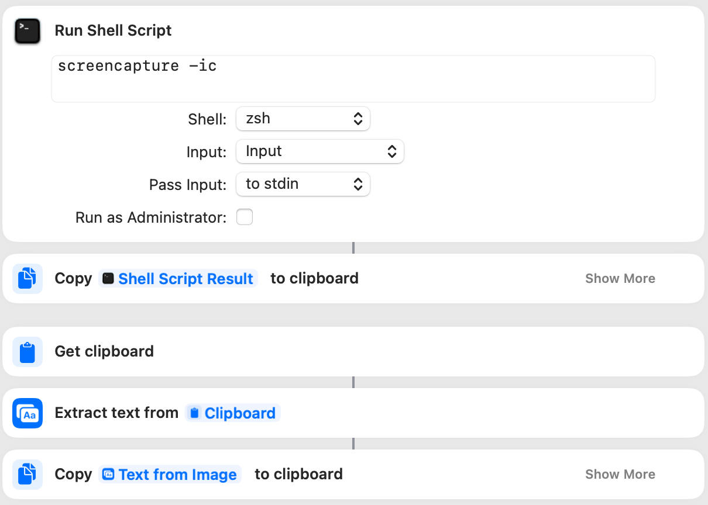

# Screenshot2Text

A free alternative to Text Sniper. Capture a screenshot and extract text to clipboard via built-in macOS Shorcuts app.

## Install

Download the `.shortcut` file from this repo and import it into the macOS Shortcuts app, or create it yourself:

1. Open the **Shortcuts** app on macOS. Click + to make new shorcut
2. Drag and drop items from side menu as follows  "screencapture -ic" to Run Shell Script.

Drag and drop the following actions from the items on the side

## How to use

1. Press `Command + Shift + 2` to capture a screenshot.
2. OCR text is automatically copied to your clipboard.

## Why?

macOS already includes everything you need to capture and extract text from screenshots. No need to pay for third-party apps.
