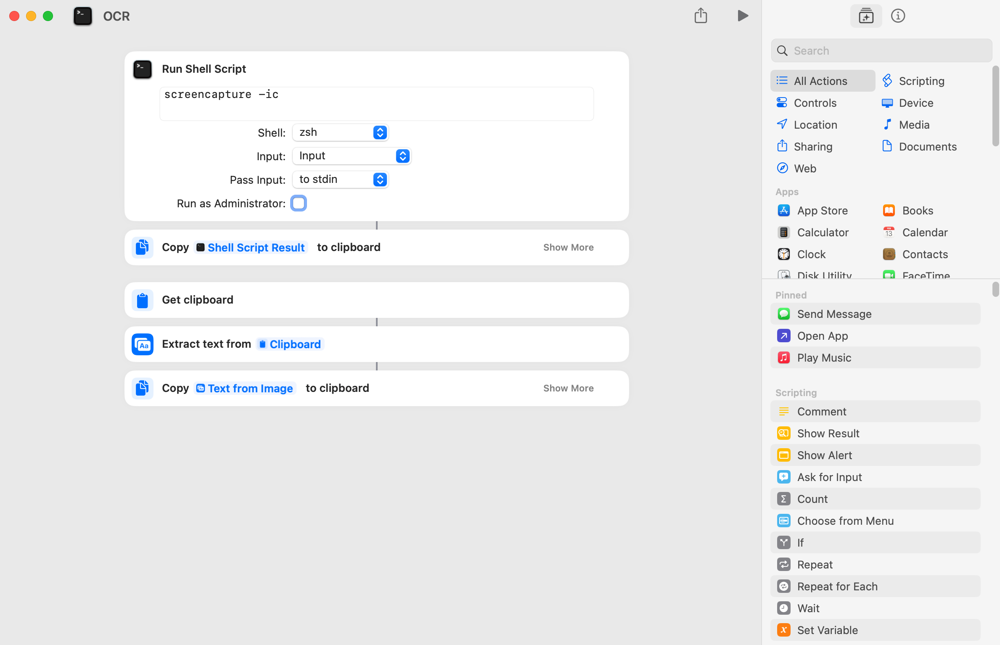
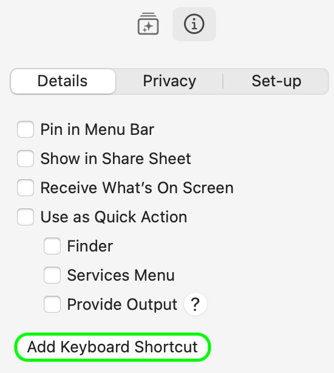

# Screenshot2Text

A free alternative to Text Sniper. Capture a screenshot and extract text to clipboard via built-in macOS Shorcuts app.

GIF HERE

## Install

1. Download the `.shortcut` file from this repo and import it into the macOS Shortcuts app.

2. Double click on it to edit. Click the 'i' icon in the side menu then select the 'Add Keyboard Shortcut' option. Command + Shift + 2 is reccomended.
3. Allow privacy requests to 'run shell script' and 'capture screen' if prompted.
4. Check these settings are enabled:
   
SCREENSHOTS

6. **Troubleshooting:**
   The tool works great with Chrome but may not behave as expected in some other apps. To ensure smooth operation, exit full-screen mode, click on the desktop background to switch to Finder, and then capture the desired text area.

GIF Here

## DIY:

1. Open the **Shortcuts** app on macOS. Click + to make new shorcut
2. Drag and drop items from side menu as seen below. Don't forget to add "screencapture -ic" to the Run Shell Script action.

3. Click the 'i' icon in the side menu then select the "Add Keyboard Shortcut" option. Command + Shift + 2 is reccomended. 

